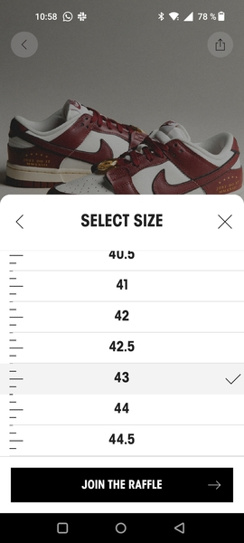

Sneaker Raffle
==============

Cuando una tienda de zapatillas recibe una remesa de sneakers de coleccion organiza una rifa entre las personas usuarias registradas para sortear el derecho a comprar la zapatilla.

Cada participante introduce sus datos personales para el envío del paquete y autoriza un cargo en su sistema de pago preferido para que, si resulta agraciada, la tienda ejecute el cobro pendiente por el precio de la zapatilla.
  
Si la participante no resulta elegida, la tienda solicita la anulación del cobro y el sistema de pago elimina el cargo en la cuenta cliente.

Sólo se permite una participación por persona, por lo que la tienda se  encarga de implementar
una serie de medidas para evitar las dobles entradas (gente que participa dos veces con la misma cuenta) y bots de personas que disponen de más de una cuenta en el sistema.

Implementa las historias de usuario de las GUI proporcionadas, pero en ASCII.

La lógica tras cada historia de usuario está descrita en el `main` de la clase principal `App.java`.

Implementa las historias de usuario de las GUI proporcionadas en la carpeta [historias de usuaria GUI](https://github.com/dfleta/sneaker-raffle/tree/main/images/user_stories), pero en ASCII.

 ## Salida de la aplicación

Intenta que la salida del programa por CLI sea lo más parecida posible a las imágenes que se proporcionan. Cada una de ellas se corresponde con una de las historias de usuario que se detallan en los epígrafes siguientes.

## Diagrama de clases UML / Arquitectura de la app.

Sigue el diagrama de clase UML proporcionado para construir la aplicación.
Si añades algún componente, dibújalo a mano alzada sobre el diagrama.

## Historias de usuario /casos de uso

Las historias de usuario están enunciadas en el script principal `Stockx.java`

1. El usuario/a solicita la info de la `Raffle`:

2. El usuario/a elige la talla:

3. El usuario/a introduce el método de pago:

4. El usuario/a visualiza los datos de su participación:

## Prepara el proyecto

 1. Crea un nuevo repo PRIVADO en tu cuenta en **Github** y compártelo con el usuario dfleta.
 2. Crea un nuevo directorio en tu equipo y **clona el repositorio** de Github.
 3. Abre VSCode /Eclipse /Netbeans /IntelIJ y **establece como workspace** el directorio que has clonado.
 4. Crea un proyecto **Gradle** o **Maven**.
 5. Pon el proyecto en seguimiento en **Git** y configura `.gitignore`.
 6. Copia y pega la función principal `App.java`. Utilízala como guía en el proceso TDD. **No puedes modificar su código**, pero sí puedes comentar aquellas partes que aun no hayas implementado.
 7. Completa las clases que aquí se indican **implementando los casos test que necesites**. Practica **TDD**.
 8. **Realiza `commits` como mínimo cada vez que termines una historia de usuario**. Sin commit periódicos, no corrijo el examen.

 ## Cómo entregar el código

 1. Crea un repo PRIVADO en tu GitHub y compártelo con el usuario dfleta.
 2. **Realiza commits periódicamente** mientras avanzas en el desarrollo de la aplicación. Sin commit periódicos, no corrijo el examen.
 3. Realiza un `push` al repo remoto en GitHub **SOLO cuando hayas terminado el proyecto**.
 3. Si quieres, si vas a dormir mejor, desde Eclipse /Netbeans /IntelIJ exporta el proyecto a un fichero. En VSCode, comprime en un ZIP la carpeta del proyecto. Envíame el archivo ZIP por correo electrónico. **No se admiten ficheros .rar**.

